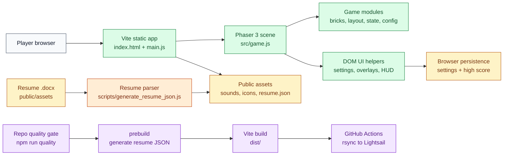
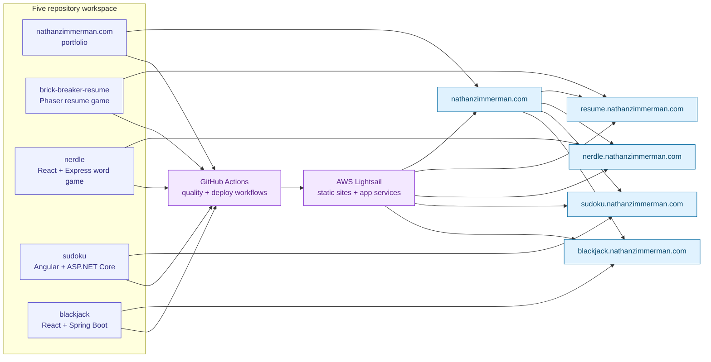

# Architecture

## Runtime Topology

Brick Breaker Resume is a static Vite application powered by Phaser 3. The browser loads the generated resume data from `public/assets/resume.json`, starts the game scene from `main.js`, and serves production assets from `dist/`.

## Architecture Diagram

## Source Boundaries

`main.js` wires app startup and UI integration. `src/` contains game state, Phaser scene logic, brick layout, UI helpers, settings, textures, and shared constants. `scripts/` owns resume document parsing and generated JSON refreshes.

## Quality Gates

Run `npm run quality` from the repo root. The gate checks Prettier formatting, ESLint, Jest coverage thresholds, resume generation through the Vite prebuild hook, and the production build.

## Deployment Flow

GitHub Actions runs the root quality gate for pull requests and pushes to `main`. Pushes to `main` upload the built `dist/` artifact, download it in the deploy job, sync it to Lightsail, and run a public health check.

## Workspace Connectivity

## Deferred Architecture Follow-Ups

Keep Phaser module boundaries stable in this pass. Future work can separate rendering adapters from game rules more strictly and add a typed schema for generated resume data.
